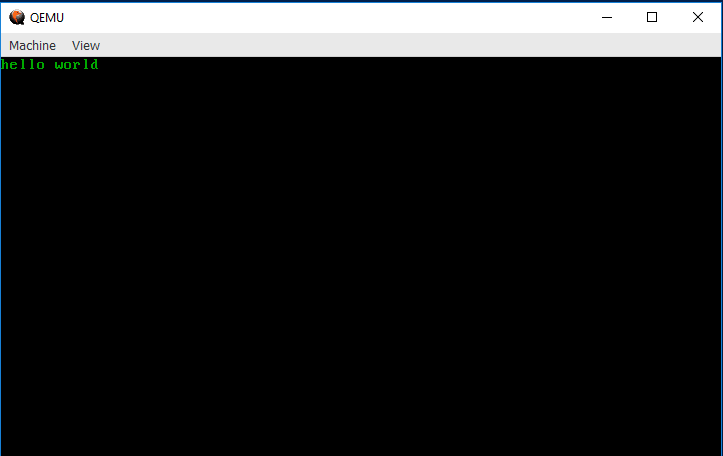

# A VGA "hello world"

In the previous chapter, we set up a "hello world" kernel, but we didn't even
print "hello world" to the screen! Let's fix that. Open up your `src/main.rs`
and modify your `_start()` function to look like this:

```rust
#[no_mangle]
pub fn _start() -> ! {
    let slice = unsafe { core::slice::from_raw_parts_mut(0xb8000 as *mut u8, 4000) };

    slice[0] = b'h';
    slice[1] = 0x02;
    slice[2] = b'e';
    slice[3] = 0x02;
    slice[4] = b'l';
    slice[5] = 0x02;
    slice[6] = b'l';
    slice[7] = 0x02;
    slice[8] = b'o';
    slice[9] = 0x02;
    slice[10] = b' ';
    slice[11] = 0x02;
    slice[12] = b'w';
    slice[13] = 0x02;
    slice[14] = b'o';
    slice[15] = 0x02;
    slice[16] = b'r';
    slice[17] = 0x02;
    slice[18] = b'l';
    slice[19] = 0x02;
    slice[20] = b'd';
    slice[21] = 0x02;

    loop {}
}
```

If you compile and build with `bootimage run`, you should see something like
this appear!



Congrats! You've gotten it to print to the screen. If you look at the code above, you
*may* be getting an idea of why VGA is called "video graphics array"... in the next
section, we'll explain what the code above is actually doing.